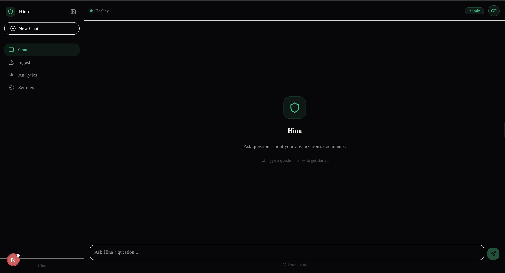
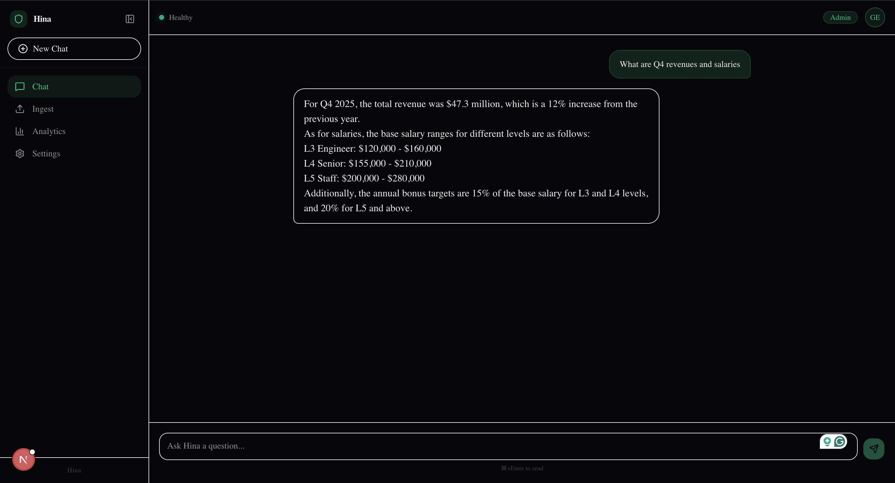
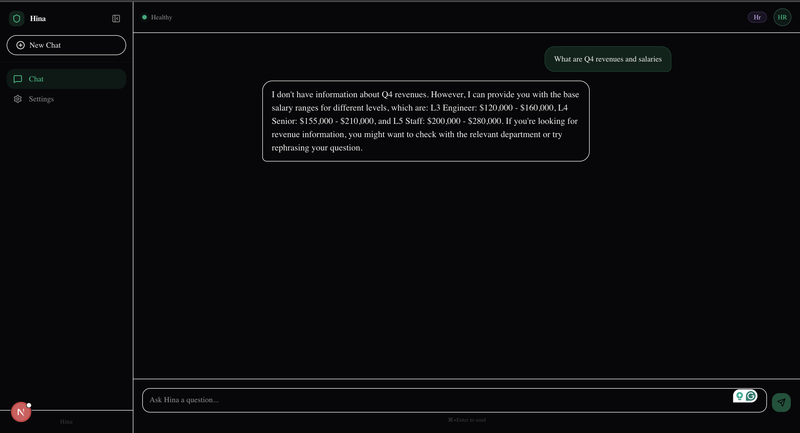
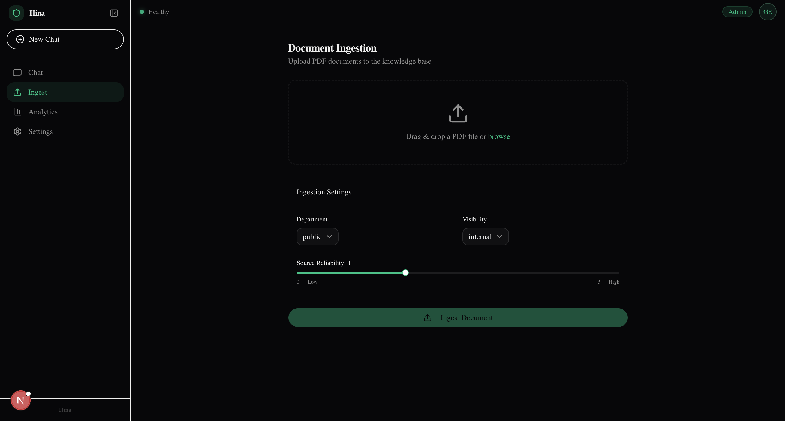

# Hina — Secure Enterprise Knowledge Assistant

Hina is an enterprise RAG (Retrieval-Augmented Generation) platform with role-based access control, multi-layer security defenses, and a conversational chat interface. Upload internal documents, and Hina answers questions — showing each user only what they're authorized to see.

## Quick Start

### Prerequisites

- Docker & Docker Compose
- A [Groq API key](https://console.groq.com) (free tier works)
- A [Supabase](https://supabase.com) project (for authentication)

### 1. Configure

```bash
cp .env.example .env.docker

# Edit .env.docker — set at minimum:
#   GROQ_API_KEY=gsk_...
#   OIDC_ISSUER_URL=https://<your-project>.supabase.co/auth/v1
#   OIDC_CLIENT_ID=secrag-client
#   OIDC_CLIENT_SECRET=<your-secret>
```

### 2. Start

```bash
./scripts/docker-up.sh
```

This starts four services:

| Service | URL | Purpose |
|---------|-----|---------|
| **Backend** | http://localhost:8000 | FastAPI application |
| **Frontend** | http://localhost:3000 | Next.js chat interface |
| **Qdrant** | http://localhost:6333 | Vector database |
| **Redis** | localhost:6379 | Cache & rate limiting |

### 3. Verify

```bash
curl http://localhost:8000/api/v1/health
# → {"status":"ok","qdrant":"ok","redis":"ok"}
```

Open http://localhost:3000, sign in, and start asking questions.

---

## Architecture

```
┌─────────────┐     ┌──────────────────────────────────────────────┐
│   Browser    │     │              Backend (FastAPI)                │
│  (Next.js)   │────▶│                                              │
│  Port 3000   │     │  ┌─────────┐  ┌──────────┐  ┌───────────┐  │
└─────────────┘     │  │  Auth   │─▶│ Jailbreak│─▶│Rate Limit │  │
                    │  │Middleware│  │ Detector │  │  (Redis)  │  │
       ┌────────┐   │  └────┬────┘  └──────────┘  └─────┬─────┘  │
       │Supabase│◀──│───────┘                            │        │
       │  Auth  │   │       JWT validated                │        │
       └────────┘   │                                    ▼        │
                    │  ┌──────────────────────────────────────┐   │
                    │  │          Query Pipeline               │   │
                    │  │                                        │   │
                    │  │  1. RBAC filter (role → dept filter)  │   │
                    │  │  2. Vector search (Qdrant)            │   │
                    │  │  3. Build prompt (XML delimiters)     │   │
                    │  │  4. LLM call (Groq, temp=0.0)        │   │
                    │  │  5. Safety check (LlamaGuard)         │   │
                    │  │  6. PII redaction                     │   │
                    │  │                                        │   │
                    │  └──────────────────────────────────────┘   │
                    │                                              │
                    │  ┌──────────┐  ┌──────────┐  ┌──────────┐  │
                    │  │  Qdrant  │  │  Redis   │  │  Groq    │  │
                    │  │ Vectors  │  │  Cache   │  │  LLM API │  │
                    │  └──────────┘  └──────────┘  └──────────┘  │
                    └──────────────────────────────────────────────┘

┌──────────────────────────────────────────────────────────────────┐
│                    Ingestion Pipeline                             │
│                                                                   │
│  PDF Upload ─▶ Parse ─▶ Sanitize ─▶ Tag (dept, trust) ─▶ Embed  │
│                           │                                ▼      │
│                    Scrub hidden text              Store in Qdrant  │
│                    Flag adversarial content       (with metadata)  │
└──────────────────────────────────────────────────────────────────┘
```

### Components

| Component | Technology | Role |
|-----------|-----------|------|
| Frontend | Next.js 16, Tailwind, shadcn/ui | Chat UI with Liquid Glass design |
| Backend | FastAPI (Python 3.12) | API gateway, pipeline orchestration |
| Auth | Supabase (OIDC/JWT, ES256) | User authentication, role management |
| Vector DB | Qdrant | Semantic search with payload filtering |
| Cache | Redis 7 | Response caching, rate limiting, quotas |
| LLM | Groq (Llama 3.3 70B) | Answer generation at temperature 0.0 |
| Embeddings | sentence-transformers/all-MiniLM-L6-v2 | 384-dim document embeddings |

---

---

### Chat Interface
Clean conversational UI with Liquid Glass design. Users ask questions and get answers grounded in their authorized documents.



### Admin View — Full Access
Admin users see answers from all departments. Here, Hina returns both Q4 revenue (Finance) and salary ranges (HR).



### HR View — RBAC Enforced
The same query as an HR user returns only HR data. Finance documents are invisible — they're excluded from the search space before the LLM ever sees them.



### Document Ingestion (Admin Only)
Admins upload PDFs tagged by department, visibility, and source reliability. Non-admin users don't see this page.



---

## Security Defenses

Hina implements six layers of defense. No single layer is trusted alone.

### Layer 1 — Gateway

| Defense | What it does |
|---------|-------------|
| **JWT Authentication** | Validates token signature (ES256/RS256), expiry, and issuer via OIDC provider's JWKS |
| **Jailbreak Detection** | Scans queries for 20+ injection patterns, including base64 and ROT13 encoded bypasses |
| **Rate Limiting** | Sliding window: 10 requests/minute per user, enforced in Redis with fail-closed circuit breaker |
| **Quota Enforcement** | Daily token limits per user (100K) and per department (50K–500K) |

### Layer 2 — Ingestion

| Defense | What it does |
|---------|-------------|
| **Hidden Text Scrubbing** | Strips zero-width characters, invisible Unicode, and control characters from uploaded PDFs |
| **Adversarial Flagging** | Detects prompt injection patterns in document content using PromptGuard + keyword matching |
| **Trust Scoring** | Scores each document section (0–4) based on source tier, recency, and author authority. Sections below 1.5 are quarantined |

### Layer 3 — Retrieval (RBAC)

| Defense | What it does |
|---------|-------------|
| **Pre-retrieval filtering** | Role-based filters are applied *before* vector search — unauthorized documents never reach the LLM |

Access matrix:

| Role | Sees | Trust threshold |
|------|------|----------------|
| Admin | All documents (including quarantined) | None |
| Finance | Finance + Corp + Public | ≥ 1.0 |
| HR | HR + Public | ≥ 1.0 |
| Standard | Public only | ≥ 1.5 |

### Layer 4 — Inference

| Defense | What it does |
|---------|-------------|
| **XML Prompt Isolation** | Retrieved content is wrapped in `<context_data>` tags with system instructions that explicitly forbid following embedded commands |
| **Deterministic output** | Temperature fixed at 0.0 — reduces hallucination variance |
| **Injected command detection** | Post-generation scan for phrases like "new instructions:", "system prompt:", etc. |

### Layer 5 — Post-generation

| Defense | What it does |
|---------|-------------|
| **LlamaGuard classification** | Checks response against 7 safety categories (illegal activity, harassment, violence, etc.) |
| **PII redaction** | Strips SSNs, email addresses, and phone numbers from responses before delivery |

### Layer 6 — Audit

| Defense | What it does |
|---------|-------------|
| **Audit trail** | Every authenticated request is logged with user ID, role, action, resource, and result in rotating JSON log files |

---


## License

Private — internal use only.
